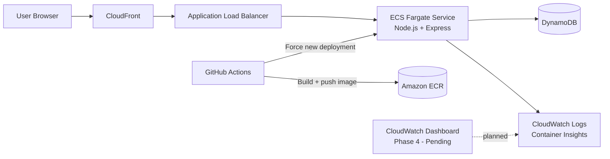

# snip. - Containerized URL Shortener on AWS

A cloud-native URL shortener built with a containerized, scalable 3-tier architecture on AWS.

Inspired by the [AWS Guidance for Building a Containerized and Scalable Web Application](https://aws.amazon.com/solutions/guidance/building-a-containerized-and-scalable-web-application-on-aws/).

---

## Delivery Status

- [x] Phase 1 - App (Node.js + Docker)
- [x] Phase 2 - Core Infra (VPC, ECS, ALB, DynamoDB, ECR)
- [x] Phase 3 - Edge (CloudFront)
- [ ] Phase 4 - CloudWatch dashboard
- [x] Phase 5 - CI/CD (GitHub Actions)

---

## Architecture (Current)

| Layer | Service | Status |
|---|---|---|
| Edge | CloudFront | Complete |
| Load Balancing | Application Load Balancer (ALB) | Complete |
| Compute | ECS Fargate (Node.js + Express) | Complete |
| Database | DynamoDB | Complete |
| Container Registry | Amazon ECR | Complete |
| Networking | VPC, public/private subnets, security groups | Complete |
| Observability | CloudWatch Logs + ECS Container Insights | Partial (dashboard pending) |
| IaC | Terraform modules | Complete |
| CI/CD | GitHub Actions workflow | Complete |

### Architecture Diagram



---

## What Was Built

### Phase 1 - Application (Node.js + Docker)

- Express API for URL shortening and redirects
- DynamoDB integration for persistent URL mappings
- Dockerized application image

### Phase 2 - Core Infrastructure (Terraform)

- VPC module with public/private networking
- ALB module with health checks and ECS target group
- ECS Fargate cluster, task definition, service, and IAM roles
- DynamoDB table module
- ECR repository module

### Phase 3 - Edge

- CloudFront distribution in front of ALB

### Phase 5 - CI/CD

- GitHub Actions workflow to:
    - build and tag Docker images
    - push images to ECR
    - trigger ECS rolling deployment
    - wait for service stabilization

### Phase 4 (In Progress)

- CloudWatch dashboard for product and system metrics

---

## API Endpoints

| Method | Endpoint | Description |
|---|---|---|
| `POST` | `/shorten` | Shorten a URL |
| `GET` | `/:code` | Redirect to original URL |
| `GET` | `/urls` | List all shortened URLs |
| `GET` | `/health` | Health check used by ALB |

---

## Project Structure

```text
snip-infra/
|- app/                  # Node.js + Express application
|  |- public/            # Static frontend assets
|  |- server.js
|  |- Dockerfile
|  `- package.json
|- infra/                # Terraform infrastructure
|  |- modules/
|  |  |- vpc/
|  |  |- ecr/
|  |  |- dynamodb/
|  |  |- ecs/
|  |  |- alb/
|  |  `- cloudfront/
|  |- main.tf
|  |- variables.tf
|  `- outputs.tf
`- .github/
     `- workflows/
            `- deploy.yml
```