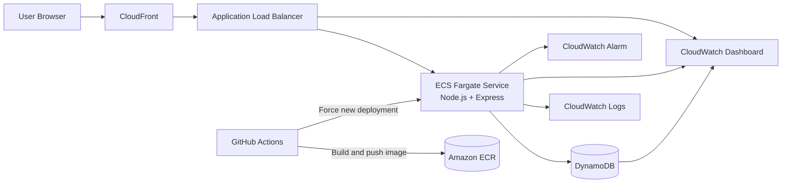

# snip. - Containerized URL Shortener on AWS

snip. is a production-style URL shortener built on AWS using a containerized Node.js application, infrastructure-as-code with Terraform, and automated deployments with GitHub Actions.

Inspired by the [AWS Guidance for Building a Containerized and Scalable Web Application](https://aws.amazon.com/solutions/guidance/building-a-containerized-and-scalable-web-application-on-aws/).

---

## Final Delivery Status

- [x] Phase 1 - App (Node.js + Docker)
- [x] Phase 2 - Core Infra (VPC, ECS, ALB, DynamoDB, ECR)
- [x] Phase 3 - Edge (CloudFront)
- [x] Phase 4 - CloudWatch dashboard
- [x] Phase 5 - CI/CD (GitHub Actions)

---

## Architecture

| Layer | AWS Service | Purpose |
|---|---|---|
| Edge | CloudFront | Global edge caching and low-latency delivery |
| Load Balancing | Application Load Balancer | Routes HTTP traffic to ECS tasks |
| Compute | ECS Fargate | Runs containerized Node.js API |
| Data | DynamoDB | Stores short code -> long URL mappings |
| Registry | Amazon ECR | Stores versioned Docker images |
| Networking | Amazon VPC | Isolates resources across public/private subnets |
| Observability | CloudWatch Logs, Dashboard, Alarms | Runtime visibility and alerting |
| Automation | GitHub Actions | Build, push, and deploy pipeline |
| IaC | Terraform | Reproducible infrastructure provisioning |


> **Infrastructure note:** This implementation uses a NAT Gateway for outbound connectivity 
> from private subnets to AWS services (ECR, DynamoDB). In a production workload, 
> VPC endpoints would replace the NAT Gateway to reduce cost and eliminate public internet 
> data transfer.

### Architecture Diagram



---

## What Was Built

### Application

- Node.js + Express API for creating and resolving short URLs
- URL validation and short code generation with `nanoid`
- Click count tracking in DynamoDB
- Health endpoint for ALB and container checks
- Static frontend served from the app container

### Infrastructure (Terraform Modules)

- `vpc`: networking and subnet layout
- `alb`: internet-facing ALB, listener, target group, and security group
- `ecs`: cluster, task definition, service, IAM roles, and log group
- `dynamodb`: URL storage table
- `ecr`: image repository
- `cloudfront`: edge distribution in front of ALB
- `cloudwatch`: dashboard widgets and high CPU alarm

### Observability

CloudWatch dashboard includes key service metrics:

- ECS CPU utilization
- ECS memory utilization
- ALB request count
- ALB target response time
- DynamoDB read capacity consumption
- DynamoDB write capacity consumption

### CI/CD

GitHub Actions workflow (on push to `main` for `app/**`) automatically:

- builds Docker image
- tags image with commit SHA and `latest`
- pushes image to ECR
- forces ECS service deployment
- waits until ECS service is stable

---

## API Endpoints

| Method | Endpoint | Description |
|---|---|---|
| `POST` | `/shorten` | Create a short URL |
| `GET` | `/:code` | Redirect to original URL |
| `GET` | `/urls` | List all shortened URLs |
| `GET` | `/health` | Health check endpoint |

---

## Repository Structure

```text
snip-infra/
|- app/
|  |- public/
|  |- server.js
|  |- Dockerfile
|  `- package.json
|- infra/
|  |- modules/
|  |  |- vpc/
|  |  |- alb/
|  |  |- ecs/
|  |  |- dynamodb/
|  |  |- ecr/
|  |  |- cloudfront/
|  |  `- cloudwatch/
|  |- main.tf
|  |- variables.tf
|  `- outputs.tf
|- .github/
|  `- workflows/
|     `- deploy.yml
`- readme.md
```

---

## Run and Deploy

### Local App Run

```bash
cd app
npm install
npm run dev
```

### Docker Build (Local)

```bash
cd app
docker build -t snip-infra:local .
docker run -p 3000:3000 snip-infra:local
```

## Prerequisites
- AWS account with CLI configured
- Terraform >= 1.5
- Docker (OrbStack or Docker Desktop)
- Node.js 20+

### Infrastructure Provisioning

```bash
cd infra
terraform init
terraform plan
terraform apply
```

### Useful Terraform Outputs

- `cloudfront_url`
- `app_url`
- `cloudwatch_dashboard`
- `ecr_repo_url`

---

## Project Outcome

This project delivers a complete, cloud-native URL shortener platform with scalable compute, managed storage, edge delivery, monitoring, and automated deployments, all defined as code.